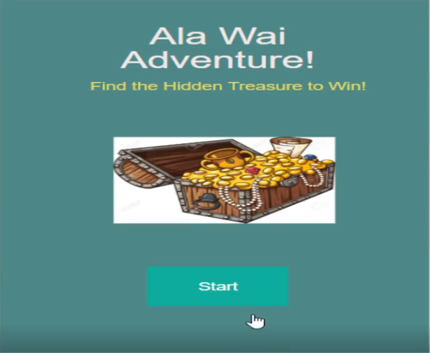
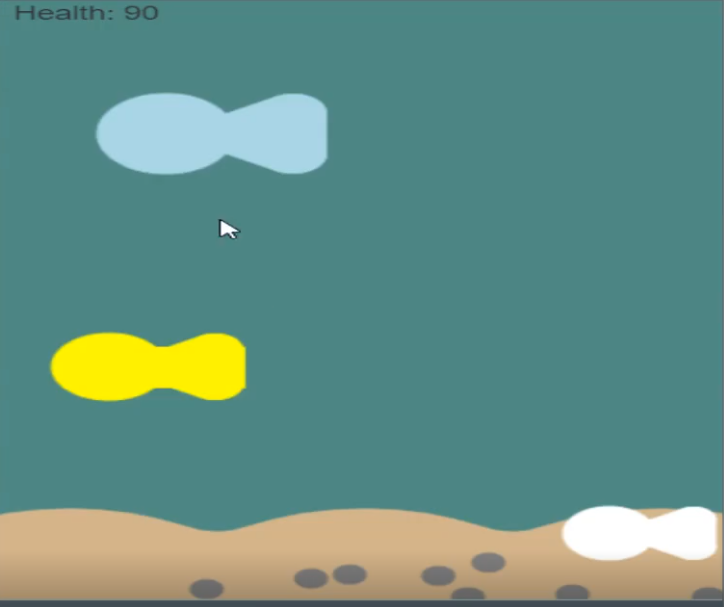
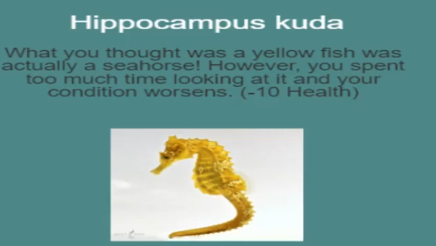
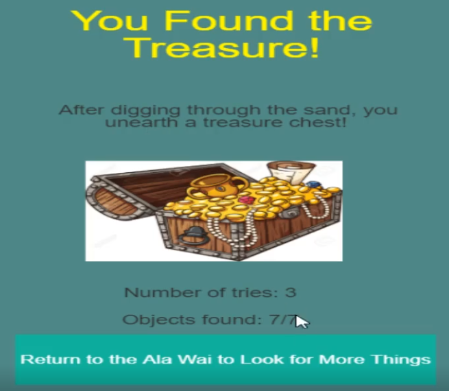

## AP CSP
AP Computer Science Principles is an Advanced Placement course that teaches students about how computers function and basic coding. My high school did not offer regular AP Computer Science so I opted to take this course instead to "jumpstart" my coding career. We learned about how logic ran through computers, computer parts, and eventually how to code. My teacher used code.org as the platform to teach us all the material that was required by the AP course. This AP course required all students to submit a unqiue final project using the coding skills they learned that was worth half of their AP score. 

## My Project
For this project, I decided to make an treasure hunting adventure game taking place in the Ala Wai. The pictures above give some illustration of what my code looked like when it was run through code.org. The scenery in the second picture was made using a turtle that drew everything from scratch. The player had to navigate using the arrow keys on the keyboard and had to interact with hidden objects on the screen using the mouse. Some interactions would be helpful, giving hints as to where the treasure was. Other interactions would be disastrous, injuring the player and depleting the player's HP bar. Once the player found the treasure, they would be taken to the end screen and it would show the amount of items they had collected while hunting and the amount of tries it took them to beat the game.

## The Project's Significance
This project has a lot of meaning to me because it was the very first coding related activity I had ever done prior to college. AP CSP introduced me to a lot of topics that I would later learn (ex. circuits that were covered in ICS 141/241) and kept my interest in computer science when I declared my major in the following Fall semester. On top of that, code.org covered a lot of coding etiquette that I still use today (ex. grouping variables, spacing out lines in code). This class also helped me with brainstorming when problem solving, especially when the course ended up covering algorithms. 

Sadly, the source code is not available as this project was a submission to the Collegeboard

