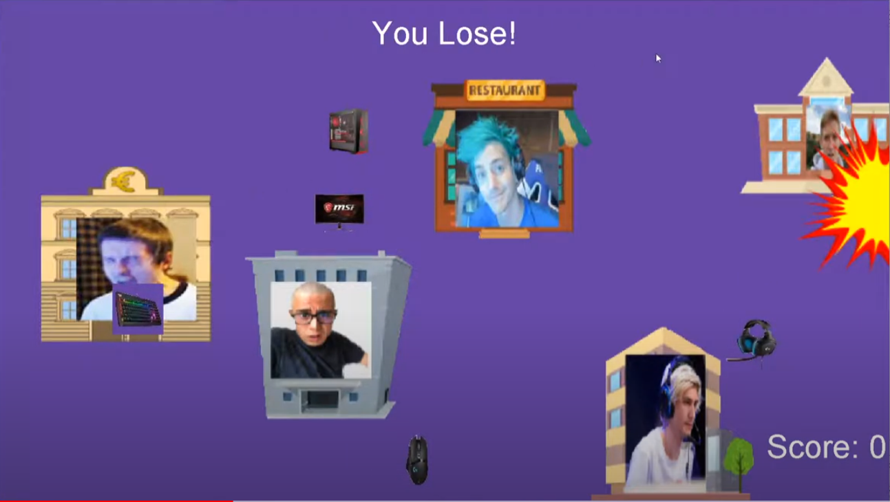
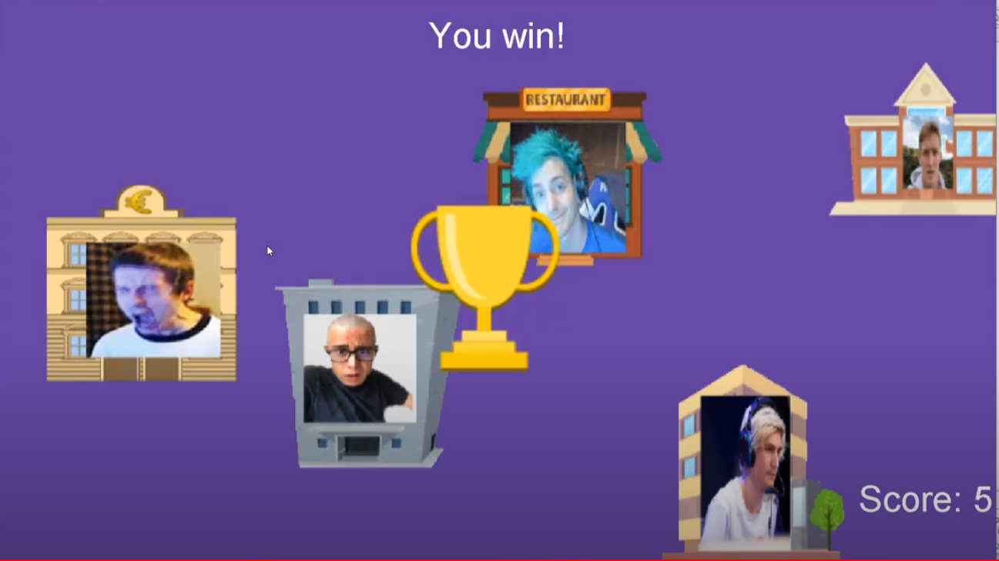

  
  

## My Project
"Don't Get Banned" is the name of my first project in my ICS 111 class in the Fall 2019 semester. The project helped me learn a lot about classes and object-oriented programming. On top of that, I also got to practice working with third-party software to develop some of the features of this game (Audacity and GIMP), which will help me in the future if I ever use those applications again. For this class, we used a variation of Java called EZ.java developed by the programmers at UH to make learning Java a little easier. Although this version of java is a lot different compared to regular Java, I still learned a lot about the fundamentals of coding from this course. This project means a lot to me because this project revolved around game development, which is something that I am interested in working with in the future. I had a lot of fun working on this project and was content with the final product.

## How the Game Works
The premise of "Don't Get Banned" is simple. The player controls a car using the WASD keys on the keyboard and drives the car to collect the five moving objects scattered across the screen. When the player picks up an object, the coordinates of the object are displayed at the top, the score for the user increases, and the object plays a unique sound indicating that it has been picked up. When all five objects are picked up, the screen displays a trophy to indicate that the user has won the game. When the player collides with a building using the car, there is a crash sound effect and an explosion image that shows. The user then has to restart the game from the beginning in order to continue.

Source Code not available since the device I created the project on has been broken. However, there is a [youtube video](https://www.youtube.com/watch?v=Eg_LTfEKoh0&feature=youtu.be) demonstrating how my project worked.

 
