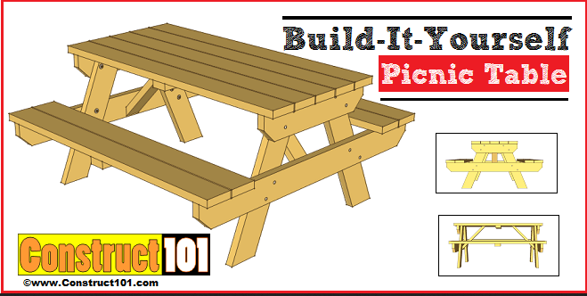

## The Project
At my high school, I was in the engineering department and decided to TA for the "Engineering Tech II" class for my senior year. Along with two other TAs, the teacher had assigned us to measure and design a table similar to the picture right (image taken from [here](https://www.construct101.com/traditional-picnic-table-plans/)) for the school as a year-long project. Our engineering teacher provided us with rulers, tape measurers, and sheets filled with the three faces of each individual part of the table. The woodshop teacher allowed us to use his shop to reference the picnic tables that the school already had already made.

Once we had all the parts measured out, we had to use AutoDesk Inventor to model the bench. AutoDesk Inventor is a 3-D modeling software that allows you to shape various objects and combine them together for a final object. Although building each invidiaul part on AutoDesk was easy, it was very difficult connecting all the parts together into a table since the measurements had to be exact. If there was a small error in the measurements, the pieces would not mesh together on the program. I was in charge of putting all the pieces together once we had 3-D modeled each individual part. It took the other TA's and I the entire school year to finish this project since there were many errors in measurements that had to be fixed. Sadly, we never got to see if the bench was ever made since we graduated the following year.

## The Project's Impact on Me
This was one of the first group projects that I worked on that required a lot of teammwork and communication from each person; it felt like a real team effort working with the other TA's. It also helped that I did not know the other TA's that well, meaning that I could work on my communication skills. I feel like this project helped prepare me for the future, as I will also work on long projects with strangers whether it be in school or at my job. I am very grateful that my engineering teacher provided us with this opportunity and hope that the skills I learned while working on this project will transfer over later on.

